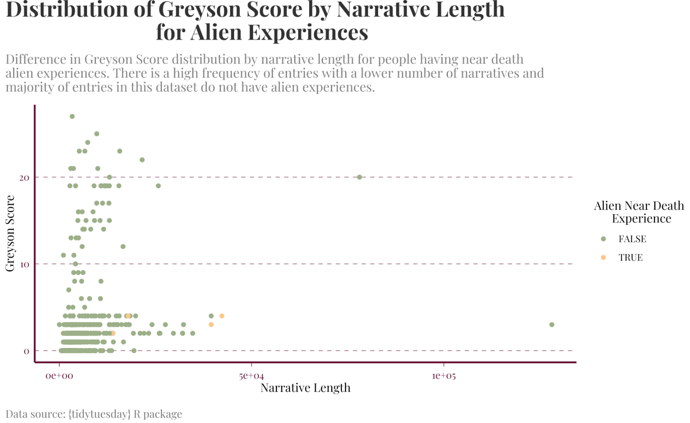

<!-- README.md is generated from README.Rmd. Please edit that file -->

# KCundercover

<!-- badges: start -->


<!-- badges: end -->

The KCundercover R package provides tools designed to make data
visualization and analysis more consistent and visually appealing. The
package includes two vignettes; One that introduce the packages theme
and one that provides example data moves that can be run on the packages
built in data set as well as an example and explanations of the package
helper function, ‘betterthanfactoring’. A brand containing the
KCundercover logo and a color palette holding all of the KCundercover
official brand colors are also contained within this package.

The packages theme vignette demonstrates how to apply the package’s
color palette and theme to create polished visualizations. The packages
theme, called ‘theme_KCundercover’, is a function that can be applied
directly to the ggplot function allowing the basic ggplot to be adapted
to fit the polished KCundercover brand. Help documentation can be found
for the theme_KCundercover function explaining the inputs and outputs of
the function allowing for a better understanding of how to use it. The
KCundercover package includes a color palette, ‘my_colors’ that contains
our specific brand colors contained within our brand.yml allowing users
to reference any specific color contained within the KCundercover brand
and apply it to a ggplot. There are 6 brand color contained within the
KCundercover my_colors palette. Details of how to do this can be found
in theme_KCundercover vignette. An Example plot showing off
theme_KCundercover and brand colors can be seen below, addition example
plots can be seen in the theme_KCundercover vignette.



The second vignette within the KCundercover package contains example
data moves that have been performed on the dataset contained within the
KCundercover package and the betterthanfactoring helper function. The
data set contained with in the KCundercover package is ‘neardeath1’.
This data set contains a collection of 18 variable that can be used to
assess and compare a near death experience, such as gender, country, and
greyson_score. Greyson_score is a score used to assess whether or not a
near death experience in genuine or not, any greyson score of 7 or
higher is considered a genuine near death experience. This data set
contains 589 near death experience entries. All entries come from a
different near death experience. Five data moves have been performed on
the neardeath1 data set to explore this data set and allow users to see
an introduction to some possible explorations that can be completed on
the neardeath1 data set. These five data moves can seen along with an
explanation in the DataMoves vignette. In the DataMoves vignette, new
variables can be seen being produced from the data set as well as how to
arrange the new arrangements of the data to fit the users needs.

The DataMoves vignette also contains an example and explanation of the
betterthanfactoring helper function that is contained within the
KCundercover package. The betterthanfactoring function allows users to
tell the function a data set then a list of concatenated variables that
need to be factored. The betterthanfactoring function will then factor
the list of variables for the user, allowing the new factored variable
to saved back into the original data set. Help documentation can be
found for the betterthanfactoring helper function explaining the inputs
and outputs of the function allowing for a better understanding of how
to use it. The betterthanfactoring helper function is an useful function
that takes away part of the hassle of cleaning data by making factoring
easier and more efficient allowing users to spend more time on their
data analysis.

## Installation

You can install the development version of KCundercover from
[GitHub](https://github.com/) with:

``` r
# install.packages("pak")
pak::pak("kgc010/KCundercover")
```

## Decision about Package

When creating the KCundercover package a few important things needed to
be taken into account, such as accessibility and usefulness. My goal
when creating the KCundercover package was to support more efficient
decision-making during data cleaning, analysis, and visualization by
providing tools that simplify common tasks and explanation of simple
data moves that can allow for better data exploration. The decision to
create betterthanfactoring helper function to reduce the time and effort
required to factor multiple variables within a data set was made solely
because it took a rather long time to manually factor each variable
individually to work with the neardeath1 data set. Silly me, decided to
make the betterthanfactoring function last so I did not get to
experience the efficiency of the helper function while making this
project.

When making the KCundercover package, I took in account accessibility
and consistency in data visualization by providing the six official
KCundercover brand colors through the my_colors palette and providing an
example and explanation of how to incorporating them into a ggplot.
These colors were picked from a list of my favorite colors, of course,
and ran through an accessibility checker to make sure users with any
level of color blindness would still find the KCundercover brand
accessible. The ultimate goal of the KCundercover brand and theme was to
promote a consistent visual theme across figures and makes polished
visualizations more accessible to users with different levels of
experience in RStudio.

The theme, data moves, and helper function vignettes and associated help
documentation provide guidance on applying the different aspects of the
KCundercover package. In hopes to make users of different experience
levels find this package helpfyl and easy to use, because learning R can
be a straining task at first. Decisions made about the
betterthanfactoring help function, theme_KCundercover function, and
KCundercover brand were made to make the KCundercover package useful as
well as simple and easy for users to use within their own coding
experiences, by having the accessibility when it comes to colors and its
built-in resources and supporting a more efficient workflow for data
analysis and presentation.

## Basic Example of Betterthanfactoring Helper Function:

This is a basic betterthanfactoring example which shows you how the
function can be used:

``` r
# setup for example
library(KCundercover)
#> Loading required package: tidyverse
#> ── Attaching core tidyverse packages ──────────────────────── tidyverse 2.0.0 ──
#> ✔ dplyr     1.2.1     ✔ readr     2.2.0
#> ✔ forcats   1.0.1     ✔ stringr   1.6.0
#> ✔ ggplot2   4.0.3     ✔ tibble    3.3.1
#> ✔ lubridate 1.9.5     ✔ tidyr     1.3.2
#> ✔ purrr     1.2.2     
#> ── Conflicts ────────────────────────────────────────── tidyverse_conflicts() ──
#> ✖ dplyr::filter() masks stats::filter()
#> ✖ dplyr::lag()    masks stats::lag()
#> ℹ Use the conflicted package (<http://conflicted.r-lib.org/>) to force all conflicts to become errors
neardeath1<- readr::read_csv("https://raw.githubusercontent.com/rfordatascience/tidytuesday/refs/heads/main/data/2026/2026-07-21/nde_experiences.csv")
#> Rows: 589 Columns: 18
#> ── Column specification ────────────────────────────────────────────────────────
#> Delimiter: ","
#> chr  (5): gender, classification, country, category, language
#> dbl  (3): entry_id, greyson_score, narrative_length
#> lgl  (8): ai_obe, ai_unity, ai_hellish, ai_clinical, ai_esp, ai_past_lives, ...
#> dttm (2): post_date, exp_date
#> 
#> ℹ Use `spec()` to retrieve the full column specification for this data.
#> ℹ Specify the column types or set `show_col_types = FALSE` to quiet this message.

## basic example code

class(neardeath1$language)
#> [1] "character"
ReadmeExample <- betterthanfactoring(neardeath1, "language")
class(ReadmeExample$language)
#> [1] "factor"
```

Hope you enjoy the KCundercover package!
